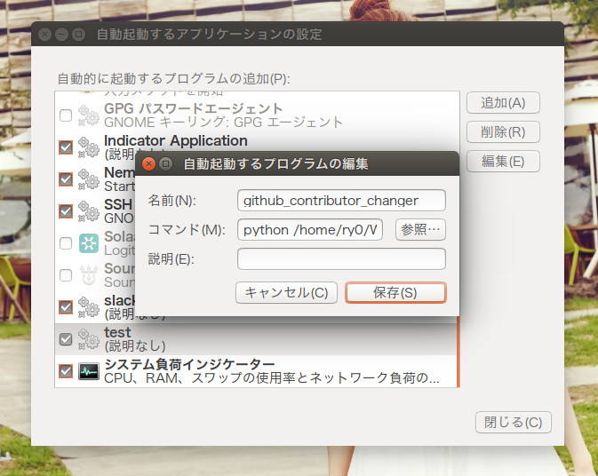

# 共用のパソコンとかでGithubのcontributorを他の人にとられなくするやつ
研究室の自分のPCじゃないやつでコミットするとき，みんながそのPCを使っているので，せっかく作った進捗が自分の手柄にならない！っていう声にお答えします！

※ただgit configの内容を書き換えているだけのプログラムです．

## 環境
* Ubuntu 14.04
* Python 2.7.6 (default, Jun 22 2015, 17:58:13)
* 動かない場合はこれをインストールすると動くかもしれません．

```bash
sudo apt-get install python-appindicator
```

## 下準備
まずクローン．

```bash
git clone https://github.com/Ry0/github_contributor_changer.git
```

このリポジトリの中に`account/account.json`があります．これを編集してください．

```json
{
    "taeyoen": {
        "mail": "taeyoen@mail.taeyoen.com"
    },
    "yoona": {
        "mail": "yoona@mail.yoona.com"
    }
}
```

このように**Githubのユーザー名**と**Githubに登録しているメールアドレス**を打ち込みます．  
正しくユーザー名を打たないと正しくアイコンが取得できません．  
またメールアドレスはしっかりGithubに登録しているメールアドレスじゃないと草が生えないので注意．

## 実行

```bash
python github_contributor_changer.py
```

で実行．
初回起動時はGithubアイコンのダウンロードがあるので，少し起動が遅いです．
起動するとタスクバーに表示されます．


選んで．．．


コミットしたいカウントをクリック！


## 自動起動させたいよ




名前は`github_contributor_changer`，コマンドは`python /home/<自分がクローンしてきた場所>/github_contributor_changer/github_contributor_changer.py`のように絶対パスで登録します．

**これでGithubの草を絶やしたくないひとには便利？？？✌ ('ω' ✌ )三 ✌ ('ω') ✌ 三( ✌ 'ω') ✌**